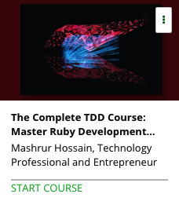

```
Roberto Nogueira  
BSd EE, MSd CE
Solution Integrator Experienced - Certified by Ericsson
```
# Udemy Master Ruby Development with RSPEC



**About **

Learn everything you need to about the subject of this `Udemy` project.

[Homepage](https://www.udemy.com/complete-tdd-course-ruby-rspec/)

## Topics
```
Section: 1
0 / 7
Introduction
[ ] 1. Introduction 1:38
[ ] 2. Demo of final project built in the course 4:40
[ ] 3. Ruby coding warm-up 3:23
[ ] Quiz 1: Ruby warm-up quiz 0:00
[ ] Quiz 2: Ruby warm-up quiz 2 0:00
[ ] Coding Exercise 0: Ruby warmup 0:00
[ ] 4. How to get help in and access documentation for the course 4:23

Section: 2
0 / 3
Setup Ruby on Rails - Online IDE and local
[ ] 5. Section overview: Development environment setup 3:12
[ ] 6. Sign up and use online IDE 8:26
[ ] 7. Local development environment setup resource (optional) 3:20

Section: 3
0 / 18
Get started with Test Driven Development
[ ] 8. Install RSpec and create first spec 12:14
[ ] 9. Intro to Test Driven Development using RSpec 11:24
[ ] 10. Project: Palindrome - Spec 16:21
[ ] 11. Project: Palindrome - Completion 19:52
[ ] Quiz 3: Let's test our knowledge so far 0:00
[ ] 12. Project: Object Oriented Programming and DRY 16:38
[ ] 13. Refactor code and use additional tools 12:46
[ ] 14. Arithmetic in Ruby 11:53
[ ] Quiz 4: Test somethings we have learnt so far 0:00
[ ] 15. Strings 18:33
[ ] 16. Strings - 2 17:14
[ ] 17. Hash and Arrays - Collections review 17:08
[ ] Quiz 5: Collections Quiz 0:00
[ ] 18. Project preview - Products inventory 1:18
[ ] 19. Project: TDD and OOP for products 14:18
[ ] 20. Project: TDD and OOP for products completion and next steps 15:00
[ ] 21. Solution to inventory value homework 0:00
[ ] Practice Test 6: Data types, Collections and OOP 0:00

Section: 4
0 / 11
Set up individual classes for broader project
[ ] 22. Preview for what is covered in the section 4:00
[ ] 23. Blackjack game rules we will follow and use 0:00
[ ] 24. Setup Card - build individual cards for use 15:20
[ ] 25. Create Deck spec 18:47
[ ] 26. Complete Deck implementation 16:08
[ ] 27. Create Deck runner and use the deck of cards 6:01
[ ] Quiz 7: Let's recap some methods 0:00
[ ] 28. Create Hand spec 11:01
[ ] 29. Calculate value for hands 15:10
[ ] Quiz 8: Important to learn this method 0:00
[ ] 30. Compress code and complete hand class 18:46

Section: 5
0 / 12
Final Project - Blackjack Game
[ ] 31. Preview of the section and completed final project 2:42
[ ] 32. Start blackjack project 15:24
[ ] Practice Test 9: Specs test 0:00
[ ] 33. Deal hands 18:17
[ ] 34. Hit function 19:33
[ ] 35. Stand function 12:24
[ ] 36. Show hands 14:43
[ ] 37. Set results 19:46
[ ] 38. Finalize the runner and test the program flow 6:29
[ ] 39. Project: Add spec and implement solution to 'Ace face down' value issue 2:28
[ ] 40. Project solution 4:55
[ ] 41. Thank you! 0:27
```
